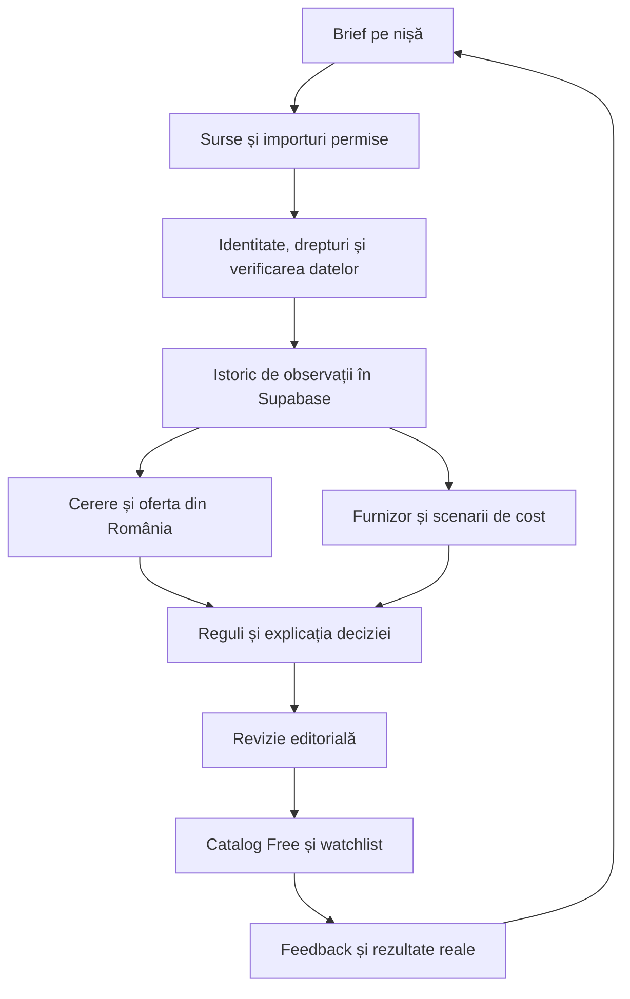

# Mega Product Radar — plan de construcție bazat pe cele trei referințe

Data cercetării: 27 septembrie 2026. Stare: **plan cu primul traseu tehnic implementat local**. Contractul, pagina Selecția MPR, stagingul Google Trends și shortlistul sunt descrise în `EDITORIAL_RADAR_OPERATIONS.md`. Catalogul public are încă zero fișe aprobate. Documentul nu activează servicii, publicare, colectare plătită sau un nou criteriu de lansare.

## 1. Direcția recomandată

Construim un radar care răspunde la cinci întrebări: ce problemă rezolvă produsul, ce dovezi de interes avem, ce ofertă există în România, dacă există o variantă generică accesibilă și ce trebuie verificat înainte de un test comercial.

Preluăm din imagini cercetarea, modulele conectate, istoricul și feedbackul. Prima imagine este cea mai apropiată de nevoia MPR. A doua descrie un sistem de comerț mult mai larg; replicile de baze de date, Redis, multe servicii și numeroși agenți nu au o justificare demonstrată pentru etapa noastră. A treia poate inspira promovarea MPR mai târziu. Producția video, publicarea socială și monetizarea automată nu rezolvă lipsa produselor documentate.

Sumele, veniturile și etichetele „LIVE” din imagini sunt afirmații ale materialelor de prezentare. Nu avem dovezi că acele rezultate sunt reproductibile sau că accesul la sursele afișate este gratuit. O parte din textul mic al celei de-a doua imagini nu este lizibilă suficient pentru identificarea fiecărui instrument.

**Promisiunea propusă pentru Free:** „Descoperă produse generice de cercetat pentru România, cu surse, data verificării și explicația recomandării.” Folosim „bestseller” numai pentru o afirmație explicită, actuală și permisă a sursei.

Această propunere restrânge prima lansare față de `MPR_MASTER_ROADMAP.md`, care păstrează viziunea pe termen lung. Nu îl înlocuiește implicit.

## 2. Ce avem deja și ce lipsește

| Componentă existentă | Ce reutilizăm | Ce trebuie completat |
| --- | --- | --- |
| `free-top25-expanded-registry.js`, `data/top25-niche-review-v1.json` | Cele 25 de nișe și limitele lor | Eliminarea suprapunerilor de concepte; mapări de sursă revizuite |
| `source-connectors.js` | Linkuri de cercetare pe marketplace-uri | Un link de căutare nu este un colector și nu confirmă un produs |
| `free-signal-research-v1.js` și panoul din `top25.html` | Linkuri și contract pentru semnale editoriale; un export Google Trends RO verificat pentru „organizator birou” | Extinderea la alte nișe și termeni, fără a transforma indicele relativ în vânzări |
| `top25-generic-selection-v1.js`, `top25-generic-snapshot-v1.js` | Revizia brandului, nișei, deduplicarea și prospețimea | Fluxul actual cere rang de sursă și un lot complet de 25; nu poate primi corect cercetare editorială fără rang |
| `review-intelligence.js` | Prima clasificare a problemelor clienților | Este o euristică pe cuvinte; trebuie păstrate unitatea de analiză, contextul și numărul real de clienți |
| `product-evidence-decision.js`, `evidence-stage-policy.js` | Regulile etapelor comerciale | Aceeași explicație în toate ecranele și distincție între publicabil, promițător și pregătit de test |
| `viral-pipeline-orchestrator.js` | Colectare, persistență, calcul, trimitere către analiza RO | Acces real și verificat la fiecare sursă; un mod de simulare reușit nu dovedește colectare reală |
| Migrările Supabase | Produse canonice, aliasuri, observații, furnizori, oferte, costuri, coadă de actualizare | Mapare la schema efectiv instalată și replay într-o bază curată înainte de extindere |
| Login, onboarding, watchlist, studiu beta | Parcursul utilizatorului | Dovezile complete cu două conturi, utilizatori reali, recuperarea accesului și telefon fizic |

Ultima validare locală, pe ramura de integrare pornită din PR #596: **1.857 teste trecute și build reușit**. Verificarea lanțului include 99 de migrări, dar nu echivalează cu replay-ul lor într-o bază nouă. Replay-ul curat a trecut în CI pentru commitul `01fbc8a`. Schimbările pentru fluxul editorial sunt pregătite separat de checkoutul local de cercetare; publicarea rămâne blocată.

Actualizare 28 septembrie: [workflow-ul GitHub Clean Supabase Migration Replay](https://github.com/ionutrosu89-cmyk/Mega-product-radar/actions/runs/36301205936) a trecut pentru commitul `64e1607` din PR #596. Logul arată 99 de migrări aplicate și patru teste SQL trecute (izolarea watchlistului comercial, izolarea și tranzițiile Intervention Watch, izolarea preferințelor). Aceasta este dovadă pentru acel commit, nu pentru modificările locale încă necomise. Proiectul Supabase conectat raportează 135 de migrări istorice, iar repository-ul are 99 de fișiere consolidate; numele și numărul nu se compară direct. Rămâne de verificat paritatea schemei efective după integrarea schimbărilor locale.

Verificarea read-only a proiectului Supabase conectat la 28 septembrie a găsit 77 de tabele în schema `public`, toate cu RLS activ, și 34 de view-uri `security_invoker`, fără acces `anon` la acestea. [Consilierul de securitate Supabase](https://supabase.com/docs/guides/database/database-linter?lint=0029_authenticated_security_definer_function_executable) semnalează două funcții `SECURITY DEFINER` executabile de `authenticated`: `mpr_sync_intervention_watch` și `record_intervention_action`. Definițiile curente verifică `auth.uid()`, apartenența la workspace și, pentru acțiune, potrivirea intervenției cu workspace-ul; testul SQL de izolare a trecut în CI. `intervention-watch.js` le apelează direct din browser, deci dreptul pentru un membru autentificat este în prezent parte a fluxului, nu un grant rămas accidental. Avertismentul nu dovedește singur un acces între workspace-uri; înainte de lansare trebuie confirmat dacă orice membru poate declanșa sincronizarea și toate tipurile de acțiune, ori dacă unele cer rol de administrator. Consilierul mai semnalează [protecția împotriva parolelor compromise](https://supabase.com/docs/guides/auth/password-security#password-strength-and-leaked-password-protection) ca neactivată; nu am modificat setările Auth.

Aceeași verificare read-only a returnat **zero rânduri** în `current_top25_snapshots_v1`. Aceasta confirmă că proiectul Supabase conectat nu deține încă snapshoturi Top25 curente; nu implică faptul că toate celelalte surse de date sau deploy-uri au fost inspectate.

Acoperirea aprobată pentru ținta 25 × 25 rămâne zero. Avem patru cereri de ofertă expediate pentru cinci configurații pilot, fără ofertă confirmată la ultima verificare. `BO-03` este suspendat, iar `BO-06` este doar alternativa în cercetare. Dosarul pilotului rămâne separat de criteriul de publicare a unui articol de cercetare Free.

Verificare 28 septembrie: `npm run editorial:report` inventariază 10 concepte, toate `DRAFT`. Șase au observații curente de identitate a **listării**: BO-02 din eBay și BO-06–BO-10 din Office Direct. Cele cinci pagini Office Direct furnizează și comparații de preț RO; identitatea și prețul observate pe aceeași pagină reprezintă **o singură sursă URL**, nu două confirmări independente. Niciun concept nu are încă identitatea generică revizuită, cererea la nivel de produs, oferta furnizorului sau costul complet confirmate. Pentru `BO-06` am corectat URL-ul comerciantului și am reverificat prețul punctual de 79,90 lei cu TVA. Feedul public conține în continuare zero produse; poarta beta editorială raportează `NO_GO`.

## 3. Sursele: ce oferă și ce putem construi pe ele

| Sursă | Utilizare în MPR | Acces și decizie pentru prima versiune |
| --- | --- | --- |
| Google Trends | Interes relativ, sezonalitate, diferențe între RO și piața externă | Exportul și reutilizarea cu atribuire sunt documentate de [Google](https://support.google.com/trends/answer/4365538?hl=en). Începem cu exportul oficial și import controlat. [API-ul este încă în alpha cu acces selectiv](https://developers.google.com/search/apis/trends). |
| Date proprii sau furnizate de parteneri | Căutări, întrebări, retururi, comenzi și rezultate reale, în limitele acordului | Prioritatea pentru semnale verificabile. Exporturile sunt minimizate și anonimizate; nu importăm liste de clienți în catalogul public. |
| Google Search Console | Ce caută oamenii ca să ajungă pe un site pentru care avem acces | [API gratuit, cu cote](https://support.google.com/webmasters/answer/12919192?hl=en). Nu arată vânzările sau căutările private ale concurenților. Conectare numai la proprietăți autorizate. |
| Magazine din România | Preț afișat, configurație, disponibilitate observată și vânzător | Cercetare punctuală și feeduri cu acord. Definim comparabil exact versus analog. Nu deducem vânzările din numărul de listări. |
| Furnizori direcți | Specificație, MOQ, preț pe cantitate, ambalaj, transport, termen | Oferte scrise și permisiuni pentru materialele care vor fi publicate. Oferta poate rămâne privată, cu rezumat public autorizat. |
| TikTok | Reclame și atenție în jurul unei probleme sau categorii | [Commercial Content API](https://developers.tiktok.com/products/commercial-content-api) cere aplicație aprobată și descrie acoperire UE. Cererea noastră prin email nu este aprobare și nu înlocuiește formularul. Nu pretindem acces la vânzările TikTok Shop. |
| Facebook / Instagram | Observații despre reclame | [Meta Ad Library](https://www.facebook.com/ads/library/) poate susține cercetarea; API și reutilizare numai după accesul și condițiile aplicabile. Facebook și Instagram nu sunt două surse independente când provin din aceeași reclamă Meta. |
| YouTube | Demonstrații, întrebări și atenție video | Există [API și cote documentate](https://developers.google.com/youtube/v3/getting-started). Verificăm proiectul și condițiile înainte de activare. Vizualizările nu reprezintă cumpărători. |
| eBay | Produse și eventual clasamente proprii eBay | [Production cere aprobarea modelului de utilizare](https://developer.ebay.com/api-docs/buy/buy-requirements.html). Cheile Developer nu rezolvă accesul. Clasamentele se integrează după aprobare, fără a bloca beta editorială. |
| Amazon / Keepa | Catalog, rang și istoric, dacă sunt licențiate | [Amazon recomandă Creators API](https://affiliate-program.amazon.com/creatorsapi/docs/) în locul vechii integrări PA-API. [Licența restrânge analiza și agregarea fără aprobare scrisă](https://affiliate-program.amazon.com/help/operating/policies). Keepa rămâne oprit conform deciziei de buget și acordului documentat local. |
| Reddit | Posibile probleme și dorințe ale clienților | [Utilizarea comercială cere permisiune și contract](https://support.reddithelp.com/hc/en-us/articles/14945211791892-Developer-Platform-Accessing-Reddit-Data), inclusiv funcții gratuite care susțin upsell. Nu îl includem ca sursă automată gratuită. |

Google Maps, Yelp și Business Profile din prima imagine sunt mai relevante pentru analiza afacerilor locale decât pentru cererea produselor generice. Nu le prioritizăm. Conținutul Places are și [restricții de stocare și atribuire](https://developers.google.com/maps/documentation/places/web-service/policies).

Pilotul Open Products Facts a găsit zero candidați eligibili în organizare birou, conform `FREE_OPEN_DATA_PILOT.md`. Îl păstrăm ca posibilă sursă de identitate pentru alte categorii, fără a-l prezenta drept clasament sau dovadă de cerere.

**Concluzia cercetării:** nu am identificat o sursă gratuită care să ofere garantat 625 de produse generice recente, popularitatea lor și toate drepturile pentru acest SaaS. Primul flux fezabil combină cercetarea proprie, datele autorizate ale partenerilor, Trends și comparații locale documentate.

## 4. Cele șase module ale radarului

| Modul | Intrare → rezultat | Criteriu de acceptare |
| --- | --- | --- |
| 1. Țintă și nișă | Nevoie, utilizator, piață, restricții → brief de cercetare | Fiecare candidat are o nișă principală și motive de includere/excludere |
| 2. Descoperire și identitate | Surse permise → concepte și listări legate | Un concept nu este numărat repetat pentru culori, pachete sau vânzători diferiți |
| 3. Cerere și probleme | Trends, date proprii, interviuri, surse sociale aprobate → dosar de dovezi | Fiecare afirmație are sursă, dată, piață și limită; reclama nu devine vânzare |
| 4. Piața din România | Oferte locale → comparație de specificație și preț | Analogi separați de potrivirile exacte; aceeași monedă, pachet și bază TVA |
| 5. Furnizor și cost | Ofertă scrisă, logistică, taxe → scenarii economice | Necunoscutul rămâne necunoscut; estimarea nu poate confirma marja |
| 6. Decizie și feedback | Dovezi + reguli → etapă, explicație, următoarea acțiune | Rezultatul poate fi refăcut din aceleași date; rezultatele testelor reale actualizează analiza |

AI poate sugera sinonime, extrage câmpuri din documente permise și redacta explicații cu trimiteri la dovezi. Identitatea finală, drepturile și promovarea etapelor sunt controlate de reguli și revizie. La buget zero, calculul, validarea și publicarea funcționează fără apeluri la un model plătit.

Recomand un singur flux de lucru cu pași expliciți. Alegerea este coerentă cu [recomandarea Anthropic de a începe cu soluții simple și de a adăuga complexitate când este justificată](https://www.anthropic.com/engineering/building-effective-agents). Nu avem nevoie de un agent separat permanent pentru fiecare nișă.

## 5. Arhitectura pe care o construim

Păstrăm frontendul existent, Netlify Functions și Supabase/Postgres. Reutilizăm `canonical_products`, `product_aliases`, `product_observations`, `data_sources`, `refresh_queue`, `supplier_quotes` și istoricul costurilor după verificarea schemei active. Adăugăm doar câmpurile sau tabelele care lipsesc efectiv; nu construim încă o bază paralelă.

Fiecare observație va distinge `observedAt` (momentul faptului observat), `retrievedAt` (colectarea), `reviewedAt` (revizia) și, unde se aplică, expirarea. Va include produsul/conceptul, piața, sursa, URL-ul, valoarea, unitatea, specificația, clasa dovezii și temeiul de utilizare. Cheile, documentele private și datele utilizatorilor rămân pe server.

Coada de lucru primește cheie de deduplicare pentru sursă–produs–fereastră, preluare atomică, număr limitat de retry-uri și jurnal de erori. Contorizăm separat limita furnizorului, consumul de infrastructură și eventualele costuri AI. La atingerea limitei, colectarea se oprește. Datele expirate își pierd eligibilitatea fără schimbarea artificială a datei observației.

Înainte de orice tabel sau endpoint nou verificăm accesul între workspace-uri și regulile RLS, folosind [documentația Supabase](https://supabase.com/docs/guides/database/postgres/row-level-security). Catalogul public expune numai câmpurile aprobate.

## 6. Catalog editorial și clasamente de sursă

Propunem două fluxuri distincte în implementare:

1. **Selecție MPR:** admite 1–25 de concepte revizuite într-o nișă, fără rang extern inventat. Va folosi un contract editorial nou, cu `sourceRank: null` și o metodă explicită de ordonare. Afișăm „12 produse documentate” când avem 12.
2. **Top25 bazat pe sursă:** păstrează cerința de 25 de poziții valide, rangul original, drepturile și prospețimea. Niciun articol editorial nu completează automat golurile acestui clasament.

Separăm aprobarea publicării de etapa comercială. Un produs poate apărea ca „În cercetare” cu identitatea și dovezile permise complete, chiar dacă oferta furnizorului lipsește. Nu poate apărea `FINALIST` sau `TEST_READY` fără verificările comerciale existente.

Stările rămân cele din politica proiectului: `DISCOVERED`, `PROMISING`, `VALIDATE`, `FINALIST`, `TEST_READY`, apoi rezultatele testelor. Pentru prima versiune arătăm separat cererea, concurența, furnizorul, costul și calitatea dovezilor. Orice scor compozit nou va fi experimental până este comparat cu rezultate reale; nu îl prezentăm ca probabilitate de profit.

Brand necunoscut, câmp de brand gol și produs generic sunt stări diferite. Revizia confirmă configurația și posibilitatea unei versiuni fără brand consacrat. Un URL de furnizor cu titlu similar nu dovedește aceeași piesă.

## 7. Cum ajungem la cele 25 × 25

Începem cu `BIROU_ORGANIZARE`; extindem apoi la `ORGANIZARE_CASA` și `CALATORII`, pe baza rezultatelor. Acestea sunt nișele pilot deja propuse în repository. Produsele electrice, pentru copii sau cu cerințe speciale rămân pentru o fază în care avem verificarea de categorie necesară.

Pentru fiecare nișă:

1. Definim cumpărătorul și problemele, apoi 5–10 expresii de căutare în română și engleză.
2. Strângem un lot de lucru, orientativ 50–100 de candidați; mărimea este o ipoteză de planificare, nu garanția că rezultă 25 eligibili.
3. Eliminăm mărcile consacrate, variantele duplicate, produsele din altă nișă și identitățile neclare.
4. Construim fișa pentru fiecare candidat rămas: specificație, interes extern/RO, problema clientului, oferta locală, surse și date.
5. Revizuim drepturile și concluzia. Publicăm numai ce trece politica modului respectiv.
6. Actualizăm cu prioritate produsele urmărite și cele cu dovezi apropiate de expirare.

Traseul de acoperire propus este **1 nișă cu 10–25 fișe → 3 nișe → 10 nișe → 25 nișe cu 25 fișe**. Nu promitem 625 de produse înainte ca ele să existe și să poată fi întreținute.

Menținem pragul actual de maximum 72 de ore pentru afirmațiile de rang/preț care îl cer. Pentru descrierea stabilă a unui concept propunem revizie la 30 de zile, separată de datele comerciale. Trends păstrează contextul ferestrei analizate și data exportului; observațiile sociale se revizuiesc săptămânal. Oferta furnizorului expiră conform documentului primit. Termenii furnizorului au prioritate față de aceste ferestre editoriale.

Ca ilustrare a efortului, la zece minute per produs, o singură revizie a 625 de produse consumă aproximativ 104 ore. De aceea, ținta completă cere colectare permisă și o rutină de întreținere, nu doar popularea inițială.

## 8. Ce vede utilizatorul

Navigația principală propusă: **Radar → Produs → Urmărire → Cont**. Administrarea surselor și colectării rămâne într-o zonă internă.

Pe Radar: nișa, problema rezolvată, motivul includerii, ultima verificare și numărul real de produse documentate. Pe fișa produsului: rezumatul original, dovezile favorabile, contradicțiile, comparația RO, costurile confirmate sau lipsă și următoarea acțiune. Watchlist-ul arată ce s-a schimbat și ce a expirat.

Preluăm din prima imagine gruparea clară în module, culorile discrete pentru stare și legătura dintre cercetare și rezultat. Evităm etichetele „validat” sau „live” pe module doar configurate. Nu afișăm lista internă de instrumente și terminalul de orchestrare în parcursul utilizatorului.

## 9. Ordinea de implementare și livrările

| Etapă | Lucru concret | Rezultat verificabil |
| --- | --- | --- |
| P0 — Scop și inventar | Documentăm beta editorială versus Top25 complet; reconciliem roadmapul; organizăm schimbările locale | Contract de produs și listă de fișiere reutilizate, extinse sau retrase; nicio schimbare implicită de criterii |
| P1 — Date și import | Contract editorial; registru de drepturi; import oficial Trends și observații manuale; identitate și istoricul surselor | Un lot real poate intra în cercetare, iar duplicatul, data viitoare sau sursa nepermisă sunt respinse |
| P2 — Fișa unică și radar | Alimentăm fișa produsului și watchlist-ul din același dosar; separăm cercetarea de verdictul comercial | Lista și detaliul dau aceeași explicație; datele expirate nu mai susțin recomandarea |
| P3 — Pilot și corectare | 10–25 fișe în prima nișă; cinci produse analizate aprofundat; verificare manuală a concluziilor | Registru de acceptări și respingeri, contradicții vizibile și cel puțin un flux de produs confirmat |
| P4 — Beta Free | Login, email, recuperare, două workspace-uri, telefon, cinci utilizatori, restaurare și suport | Protocol complet, praguri atinse, zero probleme critice și revizuire umană a publicării |
| P5 — Extindere | Repetăm procesul pe 3, apoi 10 și 25 de nișe | Fiecare nișă are acoperire și surse întreținute; clasamentul complet se activează doar cu 625 de poziții eligibile |

P1 și P2 pot avansa fără răspuns de la eBay sau Keepa. P3 depinde de dovezi reale; P4 depinde și de participanți și dispozitiv. Calendarul lansării nu poate fi garantat înaintea acestora. Evaluăm durata după primul lot funcțional, în loc să promitem o dată bazată doar pe numărul de pagini.

Primul pachet P0 + P1 parțial este implementat: schema editorială, stagingul exportului oficial Google Trends, pagina Selecția MPR, dosarul de lucru `BO-06`, shortlistul cu cheie stabilă și expirarea dovezilor. Traseul prin fișă și shortlist este testat cu fixture; testul pe un produs real aprobat în preview așteaptă revizia editorială și datele permise. Următoarea probă urmărește import → revizie → fișă → watchlist → reîncărcare → expirarea dovezii cu date reale.

## 10. Criterii de lansare

Recomand o **beta editorială Free limitată**, cu o nișă și minimum zece fișe utile revizuite. Fiecare fișă numărată pentru pragul beta trebuie să arate identitatea, interes specific produsului dintr-un domeniu independent și un comparabil românesc actual; un semnal la nivel de nișă nu îndeplinește această condiție. Este o propunere de schimbare a scopului primei lansări, nu îndeplinirea țintei 25 × 25. Codul actual rămâne `NO_GO` pentru lansarea completă.

Pentru beta propusă sunt obligatorii: utilizarea permisă a fiecărui câmp public, date actuale pentru afirmațiile curente, etichete exacte, fluxul cu două conturi, testul pe telefon, recuperarea accesului, suportul și proba de restaurare. Minimum cinci utilizatori reali trebuie să parcurgă protocolul, cu minimum 80% înțelegere a dovezilor, 60% utilitate și 80% finalizare watchlist. Sunt necesare zero probleme critice și cel puțin un flux de produs confirmat. Mostrele sau testele comerciale care necesită bani rămân blocate la bugetul actual.

Testăm emailul cu adrese externe echipei: [SMTP-ul implicit Supabase are restricții de destinatari și este destinat testării](https://supabase.com/docs/guides/auth/auth-smtp). Verificăm configurația instalată înainte să alegem un furnizor sau să promitem înregistrare publică.

Lansarea completă Top25 păstrează toate probele de mai sus și condiția 25 de nișe × 25 de produse eligibile. Poarta completă nu se dezactivează. Poarta separată pentru beta editorială este implementată, dar rezultatul actual este `NO_GO`: 0/10 fișe revizuite și eligibile pentru beta, scopul beta neaprobat și probe operaționale lipsă. Niciun rezultat al porții nu publică automat site-ul. Plățile se analizează după utilitatea demonstrată.

## 11. Buget și operare

Bugetul autorizat acum pentru abonamente și colectare nouă este **0 USD**. Plafonul anterior de 5–10 USD nu este activare automată; orice serviciu plătit ar necesita o alegere ulterioară.

| Componentă | Propunere |
| --- | --- |
| Date externe | Surse permise gratuite și contribuții autorizate; Keepa oprit |
| AI în aplicație | Oprit pentru apeluri plătite; reguli și importuri funcționale fără AI |
| Netlify | Păstrăm proiectul actual și verificăm planul; pagina publică oferă [Free cu 300 de credite/lună și Personal la 9 USD/lună](https://www.netlify.com/pricing/), cu limite și condiții de cont |
| Supabase | Păstrăm proiectul; [Free include 500 MB bază de date, iar Pro pornește de la 25 USD/lună](https://supabase.com/pricing). Free poate fi suspendat după inactivitate. Nu presupunem că planul contului este gratuit |
| Email, domeniu, backup | Inventariem ce există și probăm limitele; costurile recurente existente și munca umană nu sunt incluse în „0 USD colectare nouă” |
| Video, social publishing, orchestratoare SaaS noi | Amânate până după beta utilă |

Monitorizăm consumul înaintea extinderii. Politica este oprirea la limită, cu o stare clară pentru utilizator, fără reîncărcare automată sau apeluri plătite de rezervă. Un prototip cu cost nou zero este plauzibil; disponibilitatea și colectarea nelimitate nu sunt o promisiune realistă în acest buget.

## 12. Ce rămâne decizie de produs

Recomandarea acestui plan este beta editorială redusă, urmată de extindere la 25 × 25. Dacă păstrăm cerința ca primul acces public să conțină toate cele 625 de poziții, construim același flux, dar publicarea așteaptă acoperirea completă și operarea ei sustenabilă.

În acest demers am implementat fluxul editorial local, importul etapizat al datelor permise, raportarea și poarta separată de beta. Nu am schimbat politica de lansare, nu am activat colectare plătită și nu am trimis cereri externe noi. Referințele fotografice au fost tratate ca inspirație, nu ca instrucțiuni de executare.
